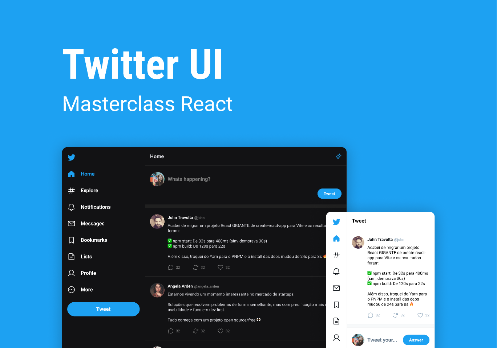

<h1 align="center"> Twiiter UI Clone </h1>

  <a href="#-tecnologias">Tecnologias</a>&nbsp;&nbsp;&nbsp;|&nbsp;&nbsp;&nbsp;
  <a href="#-projeto">Projeto</a>&nbsp;&nbsp;&nbsp;|&nbsp;&nbsp;&nbsp;
  <a href="#-layout">Layout</a>&nbsp;&nbsp;&nbsp;|&nbsp;&nbsp;&nbsp;
  <a href="#memo-licença">Licença</a>

  

 

  

## 🚀 Tecnologias

Esse projeto foi desenvolvido com as seguintes tecnologias:

- React JS
- TypeScript
- ViteJS

## 💻 Projeto

Este projeto foi realizado durante a masterclass de React oferecida pela Rocketseat. O objetivo principal foi criar uma interface de usuário (UI) semelhante ao Twitter, utilizando React e explorando os fundamentos dessa tecnologia, como componentização, propriedades, estado, formulários, entre outros.

## 🔖 Layout

Você pode visualizar o layout do projeto através [DESSE LINK](https://www.figma.com/file/4BwbgjfPWmo225YeQzIGxq/Twitter-UI-(Community)?type=design&node-id=1-937&t=A62POTBI1MuZ3JfH-0). É necessário ter conta no [Figma](https://figma.com) para acessá-lo.

## :memo: Licença

Esse projeto está sob a licença MIT.

---
